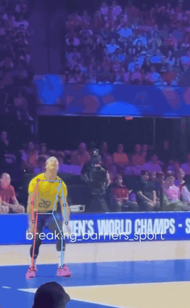

# Motion Studio

[](https://github.com/aaronhhsi/motion-studio/actions/workflows/ci.yml)

Browser-based body tracking for sports form review. Load a video and Motion
Studio marks the athlete's joints on every frame, then lets you scrub, trim,
compare and measure the movement. Everything runs locally in the browser — no
footage is ever uploaded.

**[Try it live →](https://aaronhhsi.github.io/motion-studio/)**



<sub>A jump serve tracked with the YOLOv8m model, exported from the app with the
skeleton overlay on. [Full clip (MP4)](docs/demo.mp4). Footage:
@breaking_barriers_sport.</sub>

## Features

- **Pose tracking on every frame** — 33 body landmarks with MediaPipe
  BlazePose, or 17 with YOLOv8 pose models, which hold the torso steady through
  fast rotation where BlazePose collapses it.
- **Finger tracking** — an optional second model adds 21 points per hand.
- **Left/right correction** — detects and repairs frames where the model swaps
  the athlete's left and right limbs mid-clip, flagged on the timeline.
- **Timeline** — frame-accurate scrubbing and stepping, trim in/out, looped
  playback down to 0.1×, and a motion-energy strip showing where the action is.
- **Side-by-side comparison** — two clips with independent trims, played
  together and aligned on the action.
- **Motion trails, onion skin and joint angles** — see the path a joint took
  and plot elbow, knee, hip and shoulder angles across the trim.
- **Focus scan** — lock onto a body part (arms, legs, hands) and hide the rest.
- **Crop and rescan** — re-run detection inside a box to find small or dim
  subjects.
- **Export** — landmark CSV, angle CSV, track JSON, a PNG of the frame, or the
  trimmed clip as video with the skeleton drawn on.
- **Private by design** — models run on-device via WebGPU/WebAssembly,
  MediaPipe's built-in usage logging is blocked, and a test proves analysis
  makes zero network requests.

## Run it locally

Requires [Node.js](https://nodejs.org) 18 or newer. No install or build step.

```bash
npm start          # → http://localhost:5173
```

Open the page, choose a video (or drag one onto the stage), and pick a model
from the **Tracking** panel. The models download from a CDN on first use and are
cached by the browser afterwards.

Chrome or Edge is recommended: YOLO models run on the GPU there. Firefox works
but runs YOLO on the CPU, which is much slower.

## Tests

The browser tests need Node 22+ and Chrome or Edge installed.

```bash
npm test             # unit and markup checks (fast, no browser)
npm run test:smoke   # end-to-end in headless Chrome
npm run test:all     # everything, including Firefox and the privacy audit
```

## Built with

Vanilla JavaScript (ES modules, no framework or bundler), Canvas 2D,
[MediaPipe Tasks Vision](https://ai.google.dev/edge/mediapipe/solutions/vision/pose_landmarker),
[ONNX Runtime Web](https://onnxruntime.ai/) running YOLOv8-pose, and a
zero-dependency test harness driving Chrome over the DevTools Protocol.

How it works, and why — the model comparison, the left/right repair, and the
measurements behind each decision — is written up in
[docs/NOTES.md](docs/NOTES.md).
